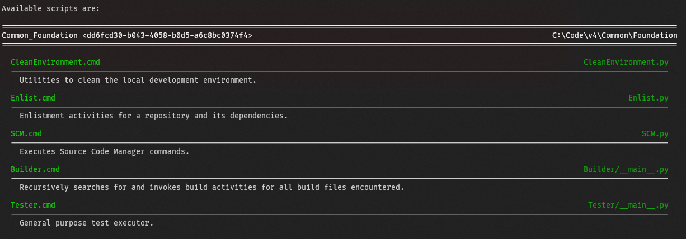

# Common_Foundation (v4.0.0)

A framework to increase the ease and reliability of development across operating systems, programming languages, and systems.

## Overview

Cross-platform development requires customizations across operating systems. Cross-language development requires different tool sets. Different repositories require different versions of the same tools and libraries. Continuous Integration / Delivery / Deployment require slightly different tools that do the exact same thing.

This framework was born from those very real and frustrating challenges and provides solutions to them all.

Repositories based on `Common_Foundation` provide a consistent set of tools across:

- Operating systems
- Programming Languages
- Repositories

More information about these benefits can be found in [Features](#features). An [Interactive Playground](#interactive-playground) is available via docker images.

## Quick Start (for developers using a repository based on `Common_Foundation`)

### Setup

Setup configures the [repository](#repository) for use in the current [environment](#environment) and is required after [enlistment](#enlistment) or after
the repository's location has changed on your local system.

| Environment | Command     |
|-------------|-------------|
| Linux       | `Setup.sh`  |
| MacOS       | `Setup.sh`  |
| Windows     | `Setup.cmd` |

### Activation

Activation prepares an [environment](#environment) for development activities. Only one [repository](#repository) may be active in a environment at a time, but a repository may be active is multiple different environments at the same time.

| Environment | Command                                         |
|-------------|-------------------------------------------------|
| Linux       | `. ./Activate.sh <python310\|python310_nolibs>` |
| MacOS       | `. ./Activate.sh <python310\|python310_nolibs>` |
| Windows     | `Activate.cmd <python310\|python310_nolibs>`    |

#### Useful Tools Available within an Activated Environment

A brief list of the functionality available out-of-the box after [activation](#activated). Run each item with the `--help` command line option for more information.

| Tool                                                         | Description                                                                                                                                        | Sample Command Line                                                                                                                      | Sample Output                                                                                                                                               |
|--------------------------------------------------------------|----------------------------------------------------------------------------------------------------------------------------------------------------|------------------------------------------------------------------------------------------------------------------------------------------|-------------------------------------------------------------------------------------------------------------------------------------------------------------|
| [Builder](Scripts/Builder/__main__.py) | Recursively builds all `Build.py` files within a directory.                                                                                        | Linux: `Builder.sh Build . /tmp/BuilderOutput`   Windows: `Builder.cmd Build . C:\Temp\BuilderOutput`                                 |                                                  |
| [Tester](Scripts/Tester/__main__.py)    | Tests functionality using a consistent interface across programming languages and test types. Includes out-of-the-box code coverage capabilities.  | Linux: `Tester.sh TestAll Scripts /tmp/TesterOutput UnitTests`   Windows: `Tester.cmd TestAll Scripts C:\Temp\TesterOutput UnitTests` |    |
| DevEnvScripts                                                | A dynamically generated list of all scripts in the activated repository and its dependencies; this file is generated during repository activation. | Linux: `DevEnvScripts.sh`   Windows: `DevEnvScripts.cmd`                                                                              |                                                                                                  |

## Features

`Common_Foundation` enables these features.

##### Consistency Across Repositories

The instructions to [setup](#setup), [activate](#activation), and even [bootstrap](#bootstrap) are consistent across all repositories.

##### Consistency Across Operating Systems

Linux-based functionality is invoked via scripts that end with `.sh`; Windows-based functionality is invoked via scripts that end with `.cmd`. Everything else is consistent. Everything.

##### Consistency Across Programming Languages

Tools use to accomplish common tasks are the same:

- [Builder](#builder) builds things.
- [Tester](#tester) tests things.

Some programming-language-specific development repositories based on `Common_Foundation`:

| Programming Language | Repository | Operating Systems |
| - | - | - |
| Python | [v4-Common_PythonDevelopment](https://github.com/davidbrownell/v4-Common_PythonDevelopment) | Linux, Windows |
| C++ (using clang) | [v4-Common_cpp_Clang](https://github.com/davidbrownell/v4-Common_cpp_Clang) | Linux, Windows |
| C++ (using Microsoft Visual Studio Build Tools) | [v4-Common_cpp_MSVC](https://github.com/davidbrownell/v4-Common_cpp_MSVC) | Windows |

##### Flexibility in Layout

[Repositories](#repository) and their dependencies do not need to conform to a common layout on your file system system - they can live anywhere and can be reused by any other repository. This means that different repositories can easily take a dependency on a common repository without concern of where it lives on your hard drive.

##### Side-by-Side Reliability

Support for [named environments](#environment) and built-in support for [semantic versioning](#semantic-version) means that you can have multi-repository dependencies without running into versioning nightmares.

##### Continuous Integration and Delivery Ready

All tooling is designed to run in different scenarios and will adapt its output to how it was invoked. For example, [Tester](#tester) output will adjust its output when run from a standard [terminal](#terminal), when run within a docker container (where embedded hyper-links cannot be processed in a cli-only environment), and with redirected output:

`Tester TestItem Scripts/Tester/Examples/UnitTests/Add.UnitTest.py`

###### Standard (Embedded hyperlinks)

###### CLI (Hyperlinks removed)

###### Redirected

### Supported Environments

These environments are built and validated regularly via [DockerPlayground](src/DockerPlayground/Build.py).
#### Linux

| Operating System | Version     | Release Date | Docker Image                                                                            |
|------------------|-------------|--------------|-----------------------------------------------------------------------------------------|
| CentOS           | 7           | 7/01/2014    | `docker pull dbrownell/common_foundation-playground:4.0.0-centos7-activated`            |
| Debian           | 11.4-slim   | 7/09/2022    | `docker pull dbrownell/common_foundation-playground:4.0.0-debian_11.4-slim-activated`   |
| Fedora           | 36          | 5/05/2022    | `docker pull dbrownell/common_foundation-playground:4.0.0-fedora_36-activated`          |
| Fedora           | 23          | 11/03/2015   | `docker pull dbrownell/common_foundation-playground:4.0.0-fedora_23-activated`          |
| Mint             | 19.3        | 12/24/2019   | `docker pull dbrownell/common_foundation-playground:4.0.0-mint_19.3-activated`          |
| openSUSE         | 15 (Leap)   | 12/03/2019   | `docker pull dbrownell/common_foundation-playground:4.0.0-opensuse_leap_15-activated`   |
| openSUSE         | 42.3 (Leap) | 7/27/2017    | `docker pull dbrownell/common_foundation-playground:4.0.0-opensuse_leap_42.3-activated` |
| Redhat           | 8 (ubi)     | 5/07/2019    | `docker pull dbrownell/common_foundation-playground:4.0.0-redhat_ubi_8-activated`       |
| Ubuntu           | 22.04       | 4/21/2022    | `docker pull dbrownell/common_foundation-playground:4.0.0-ubuntu_22.04-activated`       |
| Ubuntu           | 18.04       | 4/26/2018    | `docker pull dbrownell/common_foundation-playground:4.0.0-ubuntu_18.04-activated`       |

#### MacOS

MacOS support is currently experimental and has not been verified. [Earlier versions](https://github.com/davidbrownell/Common_Environment_v3) of this system have supported MacOS, but there are almost certainly issues that need resolution before we can consider MacOS as "supported".

#### Windows

| Scenario         | Version(s)           | Docker Image |
|------------------|----------------------|--------------|
| Standard Windows | 11, 10, Server, etc. | N/A          |
| [Nanoserver](https://hub.docker.com/_/microsoft-windows-nanoserver) | ltsc2022 | `docker pull dbrownell/common_foundation-playground:4.0.0-nanoserver_ltsc2022-activated`
| [Windows Subsystem for Linux](https://docs.microsoft.com/en-us/windows/wsl/) (WSL) | [Ubuntu 22.04](https://apps.microsoft.com/store/detail/ubuntu-22041-lts/9PN20MSR04DW?hl=en-us&gl=us), [openSUSE 15.3](https://apps.microsoft.com/store/detail/opensuse-leap-153/9N6J06BMCGT3?hl=en-us&gl=us) | N/A |

## Interactive Playground

Docker images are available at https://hub.docker.com/repository/docker/dbrownell/common_foundation-playground/. To experiment with the `Common_Foundation` repository:

On the host:

1. `docker run -it --rm docker pull dbrownell/common_foundation-playground:4.0.0-ubuntu_22.04-activated`

Once in an [activated](#activated) environment, run any of these commands to explore the available functionality:

- `Builder.sh Build . /tmp/BuilderOutput`
- `Tester.sh TestAll Scripts /tmp/TesterOutput UnitTests`
- `DevEnvScripts.sh`
- `SCM.sh Info`

## Terminology

<dl>
<dt>Repository<dt>
<dd>An instance of a revision control system for source code that controls the access, creation, maintenance, modification and use of source code. A repository based on <code>Common_Foundation</code> can be a standard repository or a <a href="#mixin-repository">Mixin Repository</a>.</dd>

<dt>Enlistment</dt>
<dd>A <a href="#repository">repository</a> cloned to your local machine.</dd>

<dt>Environment</dt>
<dd>An <a href="#enlistment">enlistment</a> that has gone through <a href="#setup">setup</a> activities. Note that an environment is named and specific to an operating system and can co-exist with other environments within the same enlistment. For example, a Windows-based environment can exist side-be-side with a Linux environment when the Linux-environment is created via [WSL](https://docs.microsoft.com/en-us/windows/wsl/install). It is also possible to create side-by-side environments by giving each a unique name:

- Default Environment: <code>Setup.sh</code> and <code>Activate.sh python310</code>
- Named Environment: <code>Setup.sh --name MyEnvironment</code> and <code>Activate.MyEnvironment.sh python310</code>
</dd>

<dt>Setup</dt>
<dd>An <a href="#enlistment">enlistment</a> where <code>Setup.sh</code> has been run successfully; an environment that is setup can be <a href="#activated">activated</a>. Setup will install operating-specific <a href="#tools">tools</a> (if any), calculate the location of dependency enlistments (if any), and create data used during the activation process. <code>Setup.sh</code> must be run after enlistment or when the location of a repository or one of its dependencies changes on your local system.</dd>

<dt>Activated</dt>
<dd>An <a href="#environment">environment</a> where <code>Activate.sh</code> has been run successfully. Activation is required in each terminal window prior to engaging in development activities. Only one environment can be activated within a terminal at a time.</dd>

<dt>Terminal</dt>
<dd>An interactive display for executing <a href="#scripts">scripts</a>/<a href="#tools">tools</a> and processing those results.</dd>

<dt>Configuration</dt>
<dd>A customization of an <a href="#environment">environment</a> specified during <a href="#activate">activation</a>. A customization allows for the alteration of a logically grouped set of <a href="#tools">tools</a>/<a href="#libraries">libraries</a>. For example, a <a href="#repository">repository</a> providing a C++ toolset might provide configurations for <code>Debug</code> and <code>Release</code> builds where only one configuration is active at a time.</dd>

<dt>Semantic Version</dt>
<dd>A <a href="https://semver.org">well-defined scheme</a> to uniquely identify a <a href="#tools">tool</a> or <a href="#libraries">library</a> dependency.</dd>

<dt>Version Conflict</dt>
<dd>The scenario in which different <a href="#repository">repositories</a> take a dependency on a <a href="#tools">tool</a>/<a href="#libraries">library</a> provided by another repository, but have different <a href="#semantic-version">version</a> requirements. Within <code>Common_Foundation</code>, <a href="#tools">Tools</a> and <a href="#libraries">Libraries</a> are organized by versions, giving a repository depending on it that ability to specify a specific version, thereby eliminating the conflict.</dd>

<dt>Mixin Repository</dt>
<dd>Only one standard <a href="#environment">environment</a> can be <a href="#activated">activated</a> at a time within a <a href="#terminal">terminal</a>. However, a mixin repository (which is limited in functionality and can only contain <a href="#scripts">scripts</a>) is an exception to this rule and can be activated within a terminal even if other repositories are already active. Multiple mixin repositories can be activated within the same terminal.</dd>

<dt>Bootstrap</dt>
<dd>The process of creating an <a href="#enlistment">enlistment</a> and running <a href="#setup">setup</a> for a repository and its dependencies. Bootstrapping and enlistment can often be a painful process, but `Common_Environment` fully automates the process.</dd>
</dl>

## Conventions

### Scripts

A script that is added to the [terminal](#terminal)'s path during [activation](#activated). `Common_Foundation` will include all scripts defined in the [repository](#repository) and its dependencies during activation.

Run `DevEnvScripts.sh` or `DevEnvScripts.cmd` at any time within an activated terminal to view all of the scripts available.

##### Repository Location
Scripts are located in `<repository_root>/Scripts/**` and can be any file type supported by the [repository](#repository) or its dependencies. `Common_Foundation` supports the script types below, but additional types can be [added by a repository](/Activate_custom.py).

##### Script Types
- Python
- [Environment](#environment)-specific scripts: `*.sh`, `*.cmd`, etc.

Visit [Scripts](/Scripts) for a list of scripts provide by `Common_Foundation`.
### Tools

A [version-specific](#semantic-version) binary associated with a [configuration](#configuration) that is added to the [terminal](#terminal)'s path during [activation](#activated). `Common_Foundation` will include all tools defined in the [repository](#repository) and its dependencies during activation.

##### Repository Location
Tools are located in `<repository_root>/Tools` and organized as:

`<tool name>/<version>[/<operating system>[/<architecture>]]`

##### Examples:
- `<repository_root>/Python/v3.10.6/Windows/x64` ([/Tools/Python/v3.10.6/Windows/x64](/Tools/Python/v3.10.6/Windows/x64))
- `<repository_root>/Python/v3.10.6/Linux/x64` ([/Tools/Python/v3.10.6/Linux/x64](/Tools/Python/v3.10.6/Linux/x64))
- `<repository_root>/ToolA/v1.2.3/Linux`

### Libraries

A library associated with a programming language and a potential [configuration](#configuration) and potential [version](#semantic-version) that is made available during [activation](#activated). The specifics of how a library is made available is considered an implementation detail and is transparent to the user. `Common_Foundation` will include all libraries defined in the [repository](#repository) and its dependencies during activation.

##### Repository Location

Libraries are located in `<repository_root>/Libraries` and organized as:

`<programming_language>/<library_name[/<version>]`

##### Examples:

- `<repository_root>/Python/Common_Foundation` ([/Libraries/Python/Common_Foundation](/Libraries/Python/Common_Foundation))
- `<repository_root>/Python/Common_FoundationEx` ([/Libraries/Python/Common_FoundationEx](/Libraries/Python/Common_FoundationEx))
- `<repository_root>/C++/boost/v1.80.0`

## Creating a New Repository Based on `Common_Foundation`

These steps outline the process of creating a new repository based on `Common_Foundation`. Examples of repositories that
have such a dependency can be found at:

- [Common_PythonDevelopment](https://github.com/davidbrownell/v4-Common_PythonDevelopment)
- [Common_DockerDevelopmentMixin](https://github.com/davidbrownell/v4-Common_DockerDevelopmentMixin)

To create a new repository:

1. Clone an empty repository to your local machine.
2. Within an [activated](#activated) environment, navigate to the directory created in the previous step.
3. Run `InitializeRepository.py`:

    - **Linux:** `python ${DEVELOPMENT_ENVIRONMENT_FOUNDATION}/RepositoryBootstrap/InitializeRepository.py`
    - **Windows:** `python %DEVELOPMENT_ENVIRONMENT_FOUNDATION%\RepositoryBootstrap\InitializeRepository.py`

4. Follow the interactive prompts to determine the initial files within the repository.
5. Follow the instructions displayed by the `InitializeRepository.py` script.
6. Add [scripts](#scripts), [tools](#tools), and [libraries](#libraries) to your repository.
